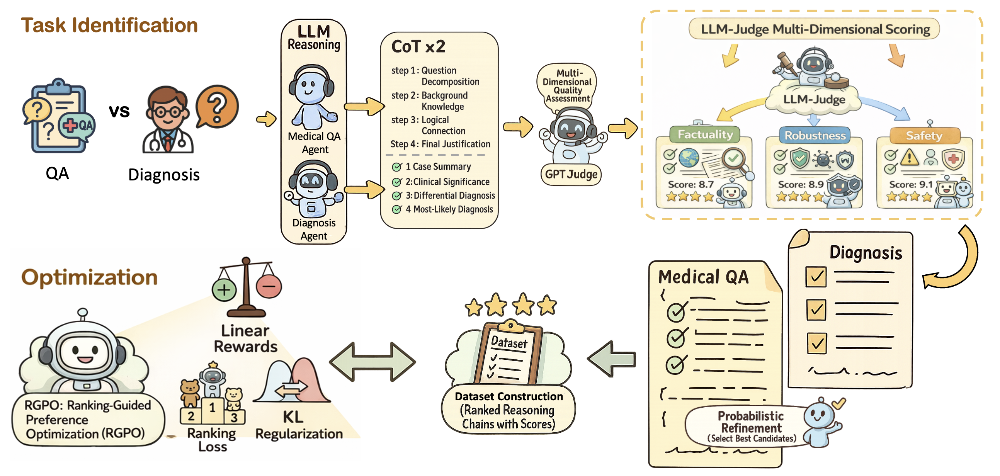

# RGPO: Ranking-Guided Preference Optimization for Reliable Clinical Reasoning

### Accepted by IEEE Transactions on Artificial Intelligence (TAI), 2026

A novel framework that enhances medical question answering by combining reinforcement learning with preference-driven reasoning refinement. RGPO automatically identifies and corrects low-quality reasoning chains to improve clinical chain-of-thought performance.

## Key Contributions

- **Probabilistic Refinement**: Multiplicative quality filter over coverage, factual accuracy, and redundancy
- **Task-Adaptive CoT**: Structured templates for medical QA and diagnostic reasoning
- **Groupwise Ranking Optimization**: Extends Bradley-Terry to full listwise rankings, beyond pairwise DPO
- **Linear Reward Shaping**: Position-based rewards that correct rank compression
- **Efficient Training**: 2B model outperforms 7B–20B baselines on PubMedQA, MedQA-USMLE, and a real-world hospital dataset

<!--
## Results

- Outperforms larger 7B–20B models (including medical-specialized variants) on PubMedQA, MedQA-USMLE, and the real-world FEMH clinical dataset
- Demonstrates that quality-driven refinement beats simple parameter scaling
- Achieves **62.02% accuracy on PubMedQA** and **51.67% accuracy on MedQA-USMLE** (5-shot setting)
- On the FEMH real-world clinical dataset, achieves BERTScore-F1 of **0.891** and Cosine Similarity of **0.528** (5-shot setting)
-->

## Overview

<p align="center">
  
</p>

## Installation

```bash
pip install torch transformers numpy matplotlib
```

## Usage

Training expects a JSONL file where each line already contains a
`question` and a `ranked` list of `K` candidate reasoning chains,
ordered from best to worst (the multi-dimensional probabilistic
refinement step described in the paper, Section III-E, is used to
produce this ranked data upstream and is not part of this release).

```json
{"question": "...", "context": "...", "answer": "...", "ranked": ["<best CoT>", "...", "<worst CoT>"]}
```

### RGPO Training

The training script uses the `JsonlGRPOTrainer` class:

```python
from trainer import JsonlGRPOTrainer

trainer = JsonlGRPOTrainer(
    model_name="google/gemma-2b",
    beta=0.1,          # KL-divergence coefficient (Eq. 11)
    temperature=1.0,   # Sampling temperature used for candidate generation
    tau_bt=1.0,        # Bradley-Terry temperature (Eq. 6-7)
    hf_token=None,     # set via the HF_TOKEN environment variable if needed
)

trainer.train(
    data_file="/path/to/rgpo_cot_pairs.jsonl",
    output_dir="./rgpo_output",
    epochs=3,             # Training epochs
    batch_size=1,         # Batch size
    lr=5e-5,              # Learning rate
    use_pairwise=True,    # Enable the listwise ranking loss L_CoT-rank (Eq. 7)
)
```

`L_CoT-rank`, `L_KL`, and `L_Linear` are combined with equal weighting
as `L_total = L_CoT-rank + L_KL + L_Linear` (Eq. 13) — no extra
hyperparameter is used to balance them.

#### Training Components

- **Linear Reward Shaping**: `losses.rank_advantages()` converts candidate rank into the advantage `a_j` (Eq. 8)
- **KL-Divergence Regularization**: `losses.kl_regularization()` penalizes drift from the frozen reference model (Eq. 11)
- **Bradley-Terry Ranking Loss**: `losses.pairwise_ranking_loss()` uses full ranking information over all `K` candidates (Eq. 7)
- **Gradient Checkpointing**: memory-efficient training for longer sequences
- **Dynamic Padding**: efficient batching via `dataset.collate_fn()`

#### Training Outputs

```
rgpo_output/
├── checkpoint-epoch-1/          # Model checkpoints
├── checkpoint-epoch-2/
├── ...
├── final_model/                 # Final trained model
├── loss_history.csv            # Training metrics
└── loss_curve.png              # Loss visualization
```

#### Memory Optimization

```python
# Set before model/tokenizer loading to reduce GPU memory fragmentation
os.environ['PYTORCH_CUDA_ALLOC_CONF'] = 'expandable_segments:True'
```

### Evaluation

Evaluate ranking accuracy on held-out data:

```python
trainer.evaluate_preferences("/path/to/rgpo_cot_pairs.jsonl")
```

The evaluation computes ranking accuracy by checking if policy log-probabilities follow the expected order.

## Algorithm Details

### RGPO Loss Function

The total loss combines two components (Eq. 13):

```
L_total = L_RGPO-CoT + L_Linear
```

where `L_RGPO-CoT` is further decomposed as:

```
L_RGPO-CoT = L_CoT-rank + L_KL
```

- **L_CoT-rank**: Bradley-Terry pairwise ranking loss (Eq. 7) — captures local pairwise preference consistency
- **L_KL**: KL divergence regularization (Eq. 11) — prevents policy drift from the reference model
- **L_Linear**: Linear advantage-weighted policy gradient (Eq. 9) — enforces global position-based reward across all K candidates

### Linear Reward Shaping

For K ranked candidates, advantages are calculated as:

```
a_j = (K - r_j) - (K-1)/2
```

Where r_j is the rank of candidate j (1 = best, K = worst).

### Probabilistic Refinement

The acceptance probability is calculated as:

```
P_accept(c) = p_cov(c) × p_fact(c) × (1 - p_red(c))
```

Refinement is triggered when P_accept(c) < threshold θ (default θ = 0.6).

## File Structure

```
├── config.py
├── dataset.py
├── losses.py
├── trainer.py
├── main.py
├── loss_history.csv
├── loss_curve.png
└── rgpo_output/
    ├── checkpoint-epoch-*/
    └── final_model/
```

## Citation

If you find this work useful, please consider citing our paper.
<!--
```bibtex
@article{hsu2025rgpo,
  title={RGPO: Ranking-Guided Preference Optimization for Reliable Clinical Reasoning},
  author={Hsu, Chia-Hsuan and Ding, Jun-En and Hsu, Hsin-Ling and Hsu, Chih-Ho and Yang, Shihao and Yao, Li-Hung and Liao, Chun-Chieh and Liu, Feng and Hung, Fang-Ming},
  journal={IEEE Transactions on Artificial Intelligence},
  year={2025}
}
```
-->
<!--
## License

This project is licensed under the MIT License.
-->
